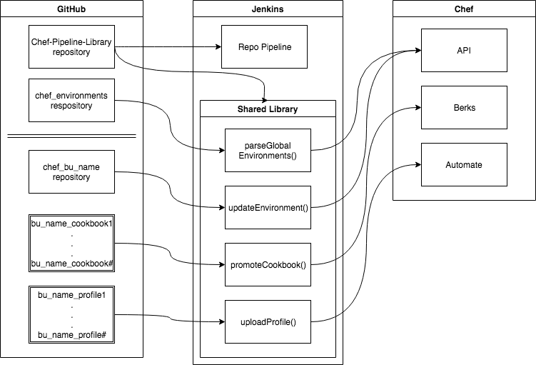
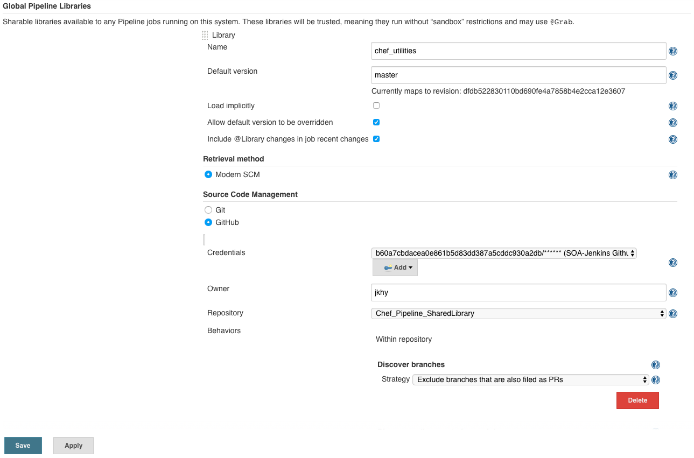

# Chef Jenkins Library

This repository contains a Jenkins library for automating Chef things and all the utilities used to automate multi-tenant usage of Chef. By using this shared library, individual business unit pipelines are greatly simplified and pipeline changes only need to be made in one place. In addition, using this type of library ensures that all activities follow a standardized process. This process provides a self-service path for BU's to perform actions such as updating their environment's run list/version pins, creating/modifying data bags, and working with Chef-Vault.

This is a visual representation of how the various pieces interact:


`See the Chef_Test_BU (https://github.com/jmassardo/Chef-Jenkins-Test-BU) for a complete example of a BU repo.`

## Installation

### Pre-req Installation

Perform these actions on the Jenkins Server.

* Ensure Git is installed and updated
  ``` bash
  sudo yum -y install git
  ```
* Ensure [ChefDK](https://downloads.chef.io/chefdk) is installed.

> NOTE: This process has only been tested on a single Jenkins master. Additional steps may be needed if using Jenkins slaves.

### Shared Library Installation

Steps to install shared library in Jenkins:
* [Fork this repository](https://www.github.com/jmassardo/Chef-Jenkins-Library/fork)
* Browse to Jenkins configuration page `Home > Manage Jenkins > Configure System` (https://jenkins.domain.tld/configure)
* Name the library (i.e. chef_automation)
* Select `Modern SCM` then `GitHub`
* Click `Add`
* Select `Credentials` then select the `Chef_Jenkins_Library` repository.

> NOTE: You will need a Personal Access Token from GitHub. Make sure this is configured as a Username/Password Credential in Jenkins. If you are forking to an organziation, you may need to authorize the token for the org.



### Library Pipeline Setup

* Create a pipeline in [Jenkins BlueOcean](https://jenkins.domain.tld/blue)
* Select GitHub 
* Select the appropriate organization 
* Select the repository (In this case, select Chef-Jenkins-Library.)
* Click `Create Pipeline`

> NOTE: You will need a Personal Access Token from GitHub. Make sure this is configured as a Username/Password Credential in Jenkins. If you are forking to an organziation, you may need to authorize the token for the org.

## Usage

### Add/Modify/Remove Feature to Library

All of the functions in the library are contained in their own file in the `/vars/` folder. In this library, we are essentially using these functions to hold our pipeline steps from a Jenkinsfile. To create new (or modify existing), it's better create a new repo with a standalone `Jenkinsfile` and do the testing there. This allows you to use the editor in Blue Ocean to build/modify the pipeline. Once it's functioning as expected, you can copy the steps into the `pipeline { }` section in `groovy` file as shown below. 

* Open (or create) `verbNoun.groovy` file
* This is the format of the file:

``` groovy
def call(String myString){
  pipeline {
    agent any
    stages {
      // add pipeline stages here
    }
    environment {
      // add environment variables here
      // i.e. my_var = "${myString}"
    }
  }
}
```

### Jenkinsfile

To use a function, create a `Jenkinsfile` in the root of the repository using this format:

``` groovy
@Library('chef_automation') _

// call function with defaults
myFunction()

// call function and pass parameters
myFunction 'my_var'
```

> NOTE: If you elected to call the library by a different name in the setup steps, you'll need to reference that new name here instead of the `chef_automation` name.

## Available Library Functions

### Parse Global Environments

The `parseGlobalEnvironments` function performs the following steps:
* Stage Environment Files
* Parse and update Environments on the Chef server

Usage:

``` groovy
@Library('chef_automation') _

parseGlobalEnvironments()
```

> NOTE: The parseGlobalEnvironments() method should only be used in your main Global_Environments repository.

### Promote Cookbook

The `promoteCookbook` function performs the following steps:
* Verify Stage
  * Lint (foodcritic)
  * Syntax (cookstyle)
  * Unit (chefspec)
* Smoke (test kitchen)
* Wait for approval
* Upload
  * Chef server

Usage:

``` groovy
@Library('chef_automation') _

promoteCookbook 'cookbook_name'
```

> NOTE: Make sure the cookbook name specified matches the folder name of the actual cookbook otherwise this step will fail.

### Update Environment

the `updateEnvironment` function performs the following steps:
* Merges BU managed environment file with globally managed environment file
* Validates that BU specified cookbooks/versions exist on Chef server
* Compares merged environment file with environment on the Chef server and uploads merge file if changes are detected.
* Parses the `data_bags`folder for json files and creates/updates data bags and data bag items.

Usage:

``` groovy
@Library('chef_automation') _

updateEnvironment()
```

### Upload Profile

the `uploadProfile` function performs the following steps:
* Performs an initial check on the profile `inspec check .`
* Logs into Automate using the data_token
  > Set the following environment variables in Jenkins (Manage Jenkins > Manage Nodes > master > Configure > Environment Variables):
  > * AUTOMATE_SERVER_NAME="https://automate.domain.tld"
  > * AUTOMATE_USER="profile_admin"
  > * AUTOMATE_ENTERPRISE="my_ent"
  > * DC_TOKEN="SuperLongAndSecretDataCollectorTokenThatShouldntBeShared..."
* Uploads profile to Automate `inspec compliance upload . --overwrite`
> NOTE: The `--overwrite` option doesn't do what one would think it does. Using this option allow Inspec to upload additional versions of the same profile.

Usage:

``` groovy
@Library('chef_automation') _

uploadProfile()
```

## Utilities

### Create_data_bag_from_json
This utility creates/modifies data bags from a BU specified folder. It uses the folder name as the name of the data bag, then creates the data bag items from each of the files within the folder.

Example:
```
ruby create_data_bag_from_json.rb -f /path/to/my/folder -k /path/to/my/knife.rb
```

Command line options:
```
Usage: create_data_bag_from_json.rb [options]
    -f, --folder /path/to/my/folder  Folder Name
    -k, --knife /path/to/my/knife.rb Knife Path
    -h, --help                       Displays Help
```

Example data bag folder structure:
```
data_bags
├── admin_users
│   ├── admin1.json
│   ├── admin2.json
│   └── admin3.json
├── limited_users
│   ├── user1.json
│   ├── user2.json
│   └── user3.json
└── op_users
    ├── op1.json
    ├── op2.json
    └── op3.json
```

### Generate_env_from_bu_json
This utility parses the bu provided environment files along with the corresponding global environment file then merges the cookbook, default attributes, and override attributes. It then verifies that all of the cookbooks and versions exist on the Chef server. Finally it uploads the environment file to the Chef server via the API.

To change a default version pin, submit a PR to your `global_environments` repository with an update to the json file for the specific environment.

Example:
```
ruby generate_env_from_bu_json.rb -k /path/to/my/knife.rb
```

Command line options:
```
Usage: generate_env_from_bu_json.rb [options]
    -k, --knife /path/to/my/knife.rb Knife Path
    -h, --help                       Displays Help
```

### Update_global_env_pins
This utility parses all the environment JSON files in the `global_envs` folder then compares them to the current environment configuration on the Chef Server. If it detects a delta, it updates the Chef Server with the newest version pins.

Example:
```
ruby Update_global_env_pins.rb -f /path/to/my/folder -k /path/to/my/knife.rb
```

Command line options:
```
Usage: Update_global_env_pins.rb [options]
    -f, --folder /path/to/my/folder  Folder Name
    -k, --knife /path/to/my/knife.rb Knife Path
    -h, --help                       Displays Help
```
